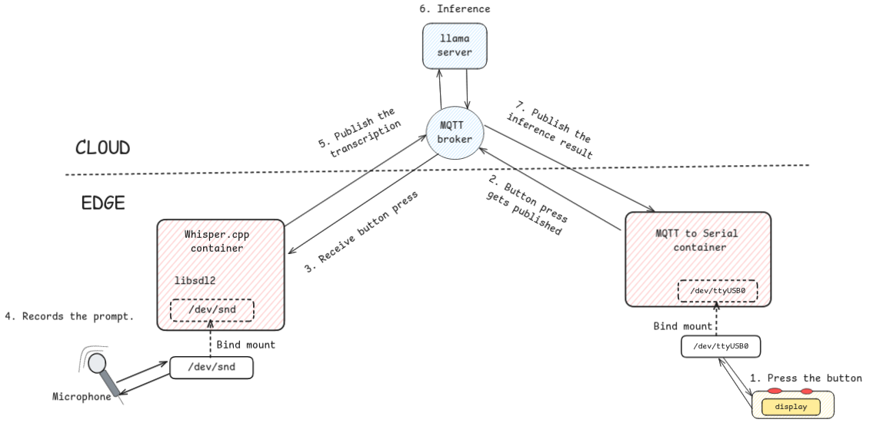
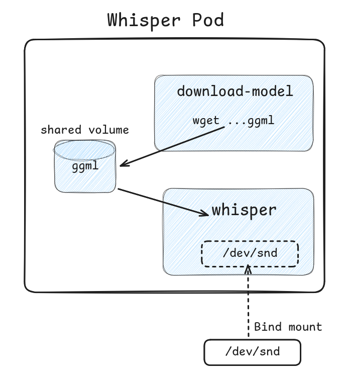
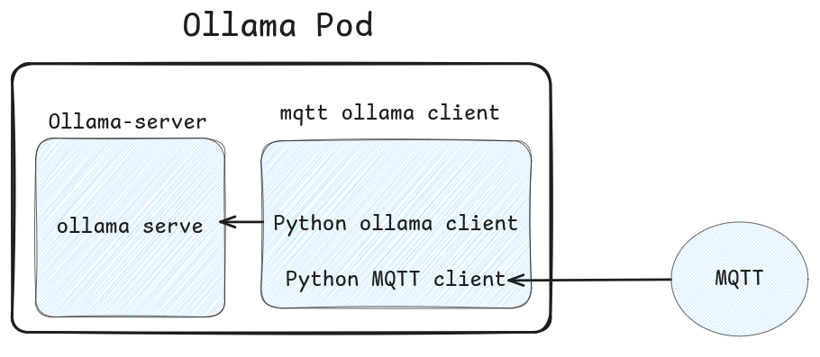

# Container Deployment Instructions

## Overview
We record speech and transcribe them at edge (using Whisper.cpp) and send them to the cloud for inference (models are served using ollama).
whisper.cpp is an inference library for running OpenAI’s Whisper speech-to-text model locally. 
Ollama is a tool for running LLMs. We will be serving tinyllama model using ollama.
The inference is then displayed at edge using the MQTTtoSerial converter mentioned in the previous hands-on.







## Prerequisites
In addition to the prerequisites for hand-on 1 and 2, we will also need a microphone attached to the Raspberry Pi.

## Build and push the images

1. **Build and push the Whisper.cpp Docker Image**
   ```bash
   cd ~/demo/workflow-3/whisper
   podman build -f Dockerfile . -t isc-tutorial.hlrs.de/"$USER"/whisper:latest
   podman push isc-tutorial.hlrs.de/"$USER"/whisper:latest
   ```

2. **Build the ollama/mqtt client Docker Image**
   ```bash
   cd ~/demo/workflow-3/ollama
   podman build -f Dockerfile . -t isc-tutorial.hlrs.de/"$USER"/mqttollamaclient:latest
   podman push isc-tutorial.hlrs.de/"$USER"/mqttollamaclient:latest
   ```

#### Deploying on Kubernetes

1. **Deploy the Whisper.cpp Publisher**
   ```bash
   envsubst < ~/demo/workflow-3/whisper/deployment.yaml | sed 's/-isc25_/-isc25-/g' | kubectl create -f -
   ```

2. **Deploy the client for ollama/mqtt**
   ```bash
   envsubst < ~/demo/workflow-3/ollama/deployment.yaml | sed 's/-isc25_/-isc25-/g' | kubectl create -f -
   ```

3. **Check the Logs**
   - **Find the Pods**
     ```bash
     kubectl get pods -n decice
     ```
   - **Logs for ollama**
     ```bash
     kubectl logs -n decice -f [whisper_pod_name]
     ```
   - **Logs for ollama**
     ```bash
     kubectl logs -n decice -f [ollama_pod_name]
     ```

### Deploying ollama at Edge
- To run Ollama at edge we can remove the "affinity" in its deployment.yaml and add the "nodeSelector" to select the raspberry Pi where we would like to run it. Refer Whisper's deployment.yaml for nodeSelector.

#### Cleanup

- **Undeploy the whisper pod**
  ```bash
   envsubst < ~/demo/workflow-3/whisper/deployment.yaml | sed 's/-isc25_/-isc25-/g' | kubectl delete -f -
  ```

- **Undeploy the ollama pod**
  ```bash
   envsubst < ~/demo/workflow-3/ollama/deployment.yaml | sed 's/-isc25_/-isc25-/g' | kubectl create -f -
  ```

